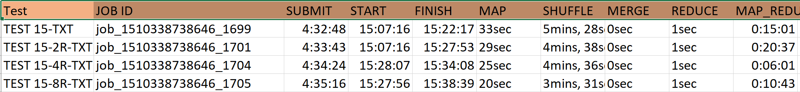

# Week-13 Cluster Assignment

##  Test 1

* Without combiner, without intermediate compression, and 1 reducers
* Without combiner, without intermediate compression, and 2 reducers
* Without combiner, without intermediate compression, and 4 reducers
* Without combiner, without intermediate compression, and 8 reducers

##  Graph


## Solution:
#### As Observed from the graph the Map reduce time is arranged in the descending order and the following observations were seen,
####  The Text file as input and with 8 reducers was listed the least time taken to complete the job amongst the all in test 1
####  The GZ file as input and with 1 reducer was observed to have taken the maximum time amongst the all in test 1
### Listing which has taken the least time for the MapReduce Process with regards to number of reducers
####  For 1 reducer, the Text file as input seems to have taken low MapReduce time
####  For 2 reducer BZ file as input seems to have taken low MapReduce time
####  For 4 reducer Text file as input seems to have taken low MapReduce time
####  For 8 reducer Text file as input seems to have taken low MapReduce time
####  Hence the Text file and Bz file as input is more efficient than the GZ file  
## File Size

## Analysis Test 1
#### The reason why the Text file as input and with 8 reducers is taking the least MapReduce time is because the text file has 64 splits, which can be processed parallelly. Hence for the data having input memory of 8.4 gb Text file as input and with 8 reducers would function the best. (Page 123 last paragraph)
#### Th reason GZ file as input and with 1 reducer was observed to have taken the maximum time because GZ file can have only one split at a time. This makes the increased MapReduce time. Gzip format datasets job has 1 Maps and Reducer for all the data set jobs. As the data file is compressed and in series, execution is largely effective than normal execution. Page 124 1st paragraph
---

## Test 2

* With combiner, with intermediate compression, and 1 reducers
* With combiner, with intermediate compression, and 2 reducers
* With combiner, with intermediate compression, and 4 reducers
* With combiner, with intermediate compression, and 8 reducers

##  Graph


## Solution:
#### As Observed from the graph the Map reduce time is arranged in the descending order and the following observations were seen,
#### The GZ file as input and with 8 reducers was listed the least time taken to complete the job
#### The Text file as input and with 1 reducer was observed to have taken the maximum time
### Listing which has taken the least time for the MapReduce Process with regards to number of reducers
#### For 1 reducer, the GZ file as input seems to have taken low MapReduce time
#### For 2 reducer GZ file as input seems to have taken low MapReduce time
#### For 4 reducer Text file as input seems to have taken low MapReduce time
#### For 8 reducer GZ file as input seems to have taken low MapReduce time
#### Hence the GZ file works good with compressed map output than the Bz file  and Text file. Over which the Bz is taking a lot of time than text.  
## Analysis Test 2
#### This kind of MapReduce process does not depend upon the input file format.
#### But this should be the best MapReduce process for having a low MapReduce time which is highly efficient and we did not observe such results from the outcome of the Test 2 that is because there were too many fetch failures observed during the MapReduce process. It may be considered due to poor machine configuration. The process is faster due to the fast transfer rate between the map output and the reducer input. Page 126
---

## Test 3

* With combiner, without intermediate compression, and 1 reducers
* With combiner, without intermediate compression, and 2 reducers
* With combiner, without intermediate compression, and 4 reducers
* With combiner, without intermediate compression, and 8 reducers

##  Graph


## Solution:
#### As Observed from the graph the Map reduce time is arranged in the descending order and the following observations were seen,
#### The Text file as input and with 8 reducers was listed the least time taken to complete the job
#### The BZ file as input and with 8 reducer was observed to have taken the maximum time
### Listing which has taken the least time for the MapReduce Process with regards to number of reducers
#### For 1 reducer, the Text file as input seems to have taken low MapReduce time
#### For 2 reducer Text file as input seems to have taken low MapReduce time
#### For 4 reducer Text file as input seems to have taken low MapReduce time
#### For 8 reducer Text file as input seems to have taken low MapReduce time
#### Hence the Text file works best than the Gz file  and Bz file. Over which the Bz is taking a lot of time than Gz. (Text best GZ bad) 

## Analysis Test 3
#### This test reduces the transfer rate between the mapper and the reducer due to the combiner class which performs as a reducer for each map output and transfers the result to the reducer, thus reducing the functionality work done by the reducer.
#### The reason why the Text file as input and with 8 reducers is taking the least MapReduce time is because the text file has 64 splits, which can be processed parallelly. Hence for the data having input memory of 8.4 gb Text file as input and with 8 reducers would function the best.(Page 123 last paragraph)
#### Th reason GZ file as input and with 1 reducer was observed to have taken the maximum time because GZ file can have only one split at a time. This makes the increased MapReduce time

#### The test result observed in the cluster was noted that this was better than Test 2, but practically the order of test based on efficient map reduce time is as below
#### Test 2(most efficient)
#### Test 3
#### Test 1 

---

## Test 4 

* Repeat test 1 using the datasets located in: ```/user/ncdc/80/``` (Lastname A-K) and  ```/user/ncdc/90/``` (Lastname L-Z) 
* For test 4-6 You will need modify your MaxTemperature code to account for bad records use the sample code on P.174 of textbook *section 6-12* to include a counter that will output the number of bad records at the end of the job -- place this new code and jar file in  Week-13 -> badrecord folder 

##  Graph


---
## Solution:
#### It has 0 bad records.
#### As Observed from the graph the Map reduce time is arranged in the descending order and the following observations were seen,
#### The BZ file as input and with 4 reducers was listed the least time taken to complete the job
#### The GZ file as input and with 1reducer was observed to have taken the maximum time
### Listing which has taken the least time for the MapReduce Process with regards to number of reducers
#### For 1 reducer, the Text file as input seems to have taken low MapReduce time
#### For 2 reducer Text file as input seems to have taken low MapReduce time
#### For 4 reducer BZ file as input seems to have taken low MapReduce time
#### For 8 reducer BZ file as input seems to have taken low MapReduce time
#### Hence the BZ file works best than the Text file  and Gz file. Over which the Gz is taking a lot of time than Text.  (BZ best, GZ bad)
## Analysis Test 4
#### Here the file size is big 103 GB hence the BZ file(57 splits) with 4 reducers have scored the best efficient amongst all in the map reduce process time
#### Th reason GZ file as input and with 1 reducer was observed to have taken the maximum time because GZ file can have only one split at a time. This makes the increased MapReduce time
#### Text file did not show up as best as there 770 splits, which might detetoriate the data nodes


## Test 5

* Repeat test 2 using the datasets located in: ```/user/ncdc/80/``` (Lastname A-K) and  ```/user/ncdc/90/``` (Lastname L-Z) 
* For test 4-6 You will need modify your MaxTemperature code to account for bad records use the sample code on P.174 of textbook *section 6-12* to include a counter that will output the number of bad records at the end of the job -- place this new code and jar file in  Week-13 -> badrecord folder 

##  Graph


## Solution:
#### It has 0 bad records.
#### As Observed from the graph the Map reduce time is arranged in the descending order and the following observations were seen,
#### The Text file as input and with 1 reducers was listed the least time taken to complete the job
#### The GZ file as input and with 2 reducer was observed to have taken the maximum time
### Listing which has taken the least time for the MapReduce Process with regards to number of reducers
#### For 1 reducer, the Text file as input seems to have taken low MapReduce time
#### For 2 reducer Text file as input seems to have taken low MapReduce time
#### For 4 reducer Text file as input seems to have taken low MapReduce time
#### For 8 reducer BZ file as input seems to have taken low MapReduce time
#### Hence the Text file works best than the Bz file  and Gz file. Over which the Gz is taking a lot of time than Text.  (Text best, GZ bad)
## Analysis Test 5
#### This kind of MapReduce process does not depend upon the input file format.
#### Hence the output for this intermediate compression with combiner should be the best amongst the test 4 5 and 6 for a 103 gb data. The best file format can be anything 
#### Hence one reducer turns out to be good fit for this data.
#### This was the best test amongst the test 5 6 and 4 in the cluster and theoretically this is true.

---

## Test 6

* Repeat test 3 using the datasets located in: ```/user/ncdc/80/``` (Lastname A-K) and  ```/user/ncdc/90/``` (Lastname L-Z) 
* For test 4-6 You will need modify your MaxTemperature code to account for bad records use the sample code on P.174 of textbook *section 6-12* to include a counter that will output the number of bad records at the end of the job -- place this new code and jar file in  Week-13 -> badrecord folder 

##  Graph


## Solution:
#### It has 0 bad records.
#### As Observed from the graph the Map reduce time is arranged in the descending order and the following observations were seen,
####  The Bz file as input and with 4 reducers was listed the least time taken to complete the job
#### The GZ file as input and with 2 reducer was observed to have taken the maximum time
### Listing which has taken the least time for the MapReduce Process with regards to number of reducers
####  For 1 reducer, the Text file as input seems to have taken low MapReduce time
####  For 2 reducer Text file as input seems to have taken low MapReduce time
####  For 4 reducer Bz file as input seems to have taken low MapReduce time
####  For 8 reducer Text file as input seems to have taken low MapReduce time
#### Hence the Text file works best than the Bz file( except for 4 reducer BZ)  and Gz file. Over which the Gz is taking a lot of time than Text.  (Text best, GZ bad)
## Analysis Test 6
#### Here the same test 3 scenarios come into picture but with the larger file.
####  Here the test fall under the second position amongst test 4, 5 and 6 and theoretically this is true

---

## Test 7 

* Repeat test 1 using the datasets located in: ```/user/ncdc/80-90/```  (ALL students)

##  Graph


## Solution:
#### It has 2 bad records.
#### As Observed from the graph the Map reduce time is arranged in the descending order and the following observations were seen,
#### The Text file as input and with 8 reducers was listed the least time taken to complete the job
####  The BZ file as input and with 1 reducer was observed to have taken the maximum time
### Listing which has taken the least time for the MapReduce Process with regards to number of reducers
#### For 1 reducer, the Text file as input seems to have taken low MapReduce time
#### For 2 reducer Text file as input seems to have taken low MapReduce time
####  For 4 reducer Bz file as input seems to have taken low MapReduce time
####  For 8 reducer Text file as input seems to have taken low MapReduce time
####  Hence the Text file works best than the Bz file( except for 4 reducer BZ) . (Text best, BZ bad)
## Analysis Test 7
####  The text file with 8 reducers has taken the least time for an 169gb data but in actual scenario this might detetoriate the data nodes as the split no is 1264, hence to the actual concept, BZ is to have the least time

---

## Test 8

* Repeat test 2 using the datasets located in: ```/user/ncdc/80-90/```  (ALL students)

##  Graph


## Solution:
#### It has 2 bad records.
#### As Observed from the graph the Map reduce time is arranged in the descending order and the following observations were seen,
####  The Text file as input and with 1 reducers was listed the least time taken to complete the job
####  The BZ file as input and with 2 reducer was observed to have taken the maximum time
### Listing which has taken the least time for the MapReduce Process with regards to number of reducers
####  For 1 reducer, the Text file as input seems to have taken low MapReduce time
####  For 2 reducer Txt file as input seems to have taken low MapReduce time
####  For 4 reducer Bz file as input seems to have taken low MapReduce time
####  For 8 reducer Text file as input seems to have taken low MapReduce time
####  Hence the Text file works best than the Bz file( except for 4 reducer BZ) . (Text best, BZ bad)
## Analysis Test 8 
#### This kind of MapReduce process does not depend upon the input file format.
#### Hence as expected, the test 8 falls first in efficiency compared to test 7 and test 9

---

## Test 9 

* Repeat test 3 using the datasets located in: ```/user/ncdc/80-90/```  (ALL students)

##  Graph


## Solution:
#### It has 2 bad records.
#### As Observed from the graph the Map reduce time is arranged in the descending order and the following observations were seen,
####  The Text file as input and with 4 reducers was listed the least time taken to complete the job
#### The BZ file as input and with 2 reducers was observed to have taken the maximum time
### Listing which has taken the least time for the MapReduce Process with regards to number of reducers
#### For 1 reducer, the Text file as input seems to have taken low MapReduce time
#### For 2 reducer Txt file as input seems to have taken low MapReduce time
#### For 4 reducer Txt file as input seems to have taken low MapReduce time
#### For 8 reducer Text file as input seems to have taken low MapReduce time
#### Hence the Text file works best than the Bz file. (Text best, BZ bad)
## Analysis Test 9 
#### These 4 reducers with text file works well as it has the best efficiency for 1264 splits, but the data node might get effected, in actual scenario bz should occur first
#### The observed pattern is 
####  Test 8,
####  Test 7
#### Test 9
####  But actual scenario sgould be 
####  Test 8 
#### Test 9
#### Test 7

---

## Test 10 

* Repeat test 1 using the dataset and the ```/user/ncdc/256/80-90/``` datasets (ALL students)
   + This increases the default Block Size to 256 mb

##  Graph


## Solution:
#### As Observed from the graph the Map reduce time is arranged in the descending order and the following observations were seen,
#### The Text file as input and with 8 reducers was listed the least time taken to complete the job
#### The Text file as input and with 1 reducers was observed to have taken the maximum time
#### Hence the Text file works with 8R
## Analysis Test 10 
#### The 8 reducer would be the best suite  for the 256 mb block size for 632 splits 

---

## Test 11 

* Repeat test 2 using the dataset and the ```/user/ncdc/256/80-90/``` datasets (ALL students)
   + This increases the default Block Size to 256 mb

##  Graph


## Solution:
#### As Observed from the graph the Map reduce time is arranged in the descending order and the following observations were seen,
#### The Text file as input and with 1 reducers was listed the least time taken to complete the job
#### The Text file as input and with 8 reducers was observed to have taken the maximum time
#### Hence the Text file works with 1R with compression

## Analysis Test 11 
####  As this is intermediate compression, 1R is the best suite for 256 mb block size for 632 splits as observed. But it is little inefficient as we observe the results compared with test 10 and test 12. It is taking so much additional map reduce time

---

## Test 12

* Repeat test 3 using the dataset and the ```/user/ncdc/256/80-90/``` datasets (ALL students)
   + This increases the default Block Size to 256 mb

##  Graph


## Solution:
####  As Observed from the graph the Map reduce time is arranged in the descending order and the following observations were seen,
####  The Text file as input and with 2 reducers was listed the least time taken to complete the job
####  The Text file as input and with 8 reducers was observed to have taken the maximum time
####  Hence the Text file works with 2R with combiner
## Analysis Test 12 
#### This test, 2R is the best suite for 256 mb block size for 632 splits as observed. As observed this falls first amongst test 10 test 11 and test 12

---

## Test 13

* Repeat test 1 using the dataset and the ```/user/ncdc/512/80-90/``` datasets (ALL students)
   + This increases the default Block Size to 512 mb

##  Graph


## Solution:
#### As Observed from the graph the Map reduce time is arranged in the descending order and the following observations were seen,
#### The Text file as input and with 4 reducers was listed the least time taken to complete the job
#### The Text file as input and with 1 reducers was observed to have taken the maximum time
#### Hence the Text file works with 4R with combiner

## Analysis Test 13
#### This test, 4R is the best suite for 512 mb block size for 316 splits as observed. As observed this falls last amongst test 13 test 14 and test 15 when referred to the MapReduce time.

--- 

## Test 14

* Repeat test 2 using the dataset and the ```/user/ncdc/512/80-90/``` datasets (ALL students)
   + This increases the default Block Size to 512 mb

##  Graph


## Solution:
#### As Observed from the graph the Map reduce time is arranged in the descending order and the following observations were seen,
####  The Text file as input and with 8 reducers was listed the least time taken to complete the job
#### The Text file as input and with 1 reducers was observed to have taken the maximum time
#### Hence the Text file works with 8R with combiner
## Analysis Test 14
#### As this is intermediate compression, this dosent depend upon the file format, hence 8 reducer is the best fit.

---

## Test 15

* Repeat test 3 using the dataset and the ```/user/ncdc/512/80-90/``` datasets (ALL students)
   + This increases the default Block Size to 512 mb

##  Graph



## Solution:
#### As Observed from the graph the Map reduce time is arranged in the descending order and the following observations were seen,
####  The Text file as input and with 4 reducers was listed the least time taken to complete the job
####  The Text file as input and with 2 reducers was observed to have taken the maximum time
#### Hence the Text file works with 4R with combiner
## Analysis Test 15
####  This test, 4R is the best suite for 512 mb block size for 316 splits as observed. As observed this falls first amongst test 13 test 14 and test 15

---

## Test 16

* Using the datasets contained in ```/user/logs/large-logs``` write and compile a MapReduce Program to do the following: For each month in the year find the page (html or php) name that has the highest number of HTTP 200 responses that is not the index.* page as well as the number (count) of those results graphed together.  Use the following years and files:
    + Lastname A-E 2012 + 2013
    + Lastname F-N 2014 + 2015
    + Lastname O-Z 2016 + 2012   
    + ```web-server-logs.txt```
    + ```web-server-logs.bz2``` 
    + ```web-server-logs.gz```
*  Graph the retrieved data, based on results of previous 15 tests, you decide the single configuration that is optimum for achieving the results and explain why you chose that configuration for this test.  Include your code inside your Github account in a folder named test-16.  Make sure all coded needed to compile and run the job is present.  Add a ReadMe.md with any instructions or assumptions in that folder.

---
## Solution:

## The detailed instruction on how to execute this test is mentioned in the test-16 folder along with the results
---
## Conclusion (test 17)

Write your general conclusion and recommendation for the optimal performance characteristics relating to **intermediate compression**, **compression**, **combiners**, **block size**, and **number of reducers** based on this work load and dataset results (reference your test results above).
## Solution:

## intermediate compression 
#### It helps in fast data transfer between the mapper and reducer due to compressed map output. It is the best when combined with combiner as it results in reduced execution time.
#### This can be referenced to the test 4, 5 and 6 over which for 103 gb data the test 5 has an best mapreduce time which is the least amongst all, which is a intermediate compression alone with combiner 
## compression
#### Gz is a compressed file which can be split only as one has a large map reduce time due to one split
#### BZ2 file is efficient as it can be splittable and posses faster map reduce time 
#### This can be reffered to test 1 2 and 3 , where the gz files posses higher mapreduce time compared to bz2 files
## combiners
#### combiners will reduce the work load of the reducer and increase the transfer rate from the mapper to the reducer. Hence the test 3 has a better performance or the lower mapreduce time than the test 1. where the test 3 uses the combiner.
## block size
#### block size works good for large amount of data say 169 gb data where as it is not efficent for lesser amount of data. The test 15 which uses 512 block size has taken a very minimal map reduce time 
## number of reducers
#### This works well with many splits of data. If the splits are 64 and if there are 8 reducers, this works really well with lower map reduce time. This case in refreed in test 3 with 8 reducers which has the least map reduce time of all.
