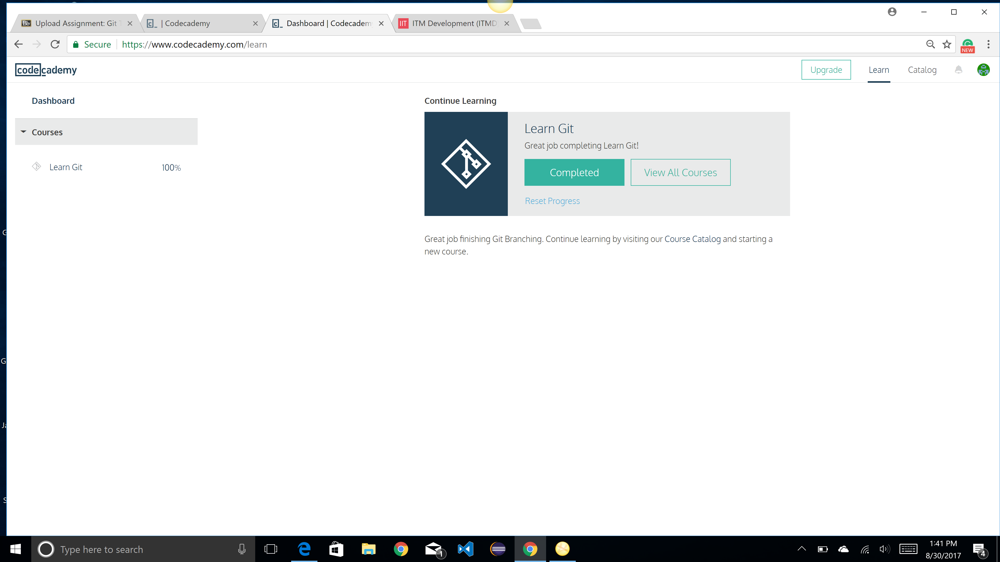
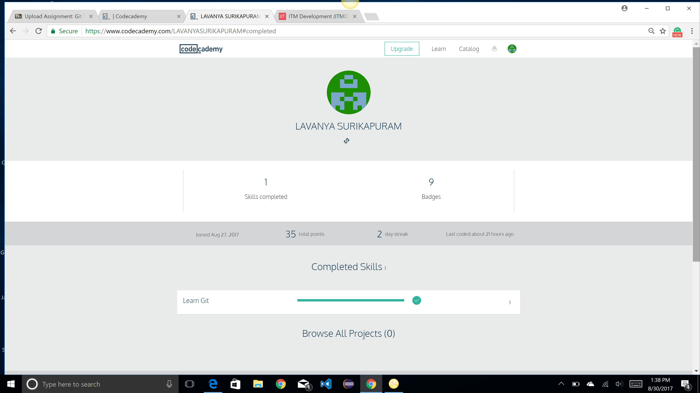
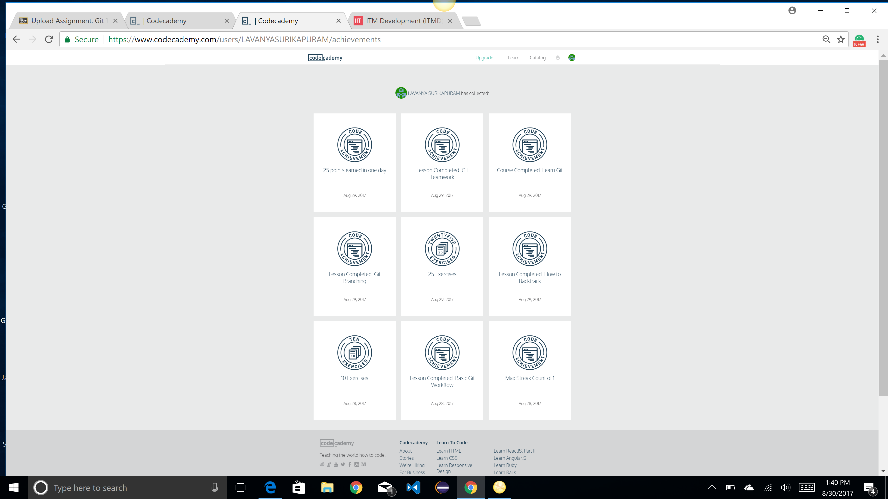

# LAVANYA SURIKAPURAM

"BEING A PROFESSIONAL WOMAN, I FUNCTION THE BEST WHEN I DON'T DISTINGUISH BETWEEN
WORK AND PLAY."

To keep the body in good health is a duty… otherwise we shall not be able to keep our mind strong and clear.” 
>The above is the image and quote that describes me.

# Where are you from?
I am from Chennai, India.

# IT Background
A passionate Software Developer, well Known for excellence in learning and implementation of latest technology skills in a short span of time. Specializes in custom Web Application Development using Python, MongoDB and Django Web framework.

I am currently pursuing my Master’s degree in Information Technology Management over which I had chosen Data Management specialization. I had gained knowledge by developing a couple of Web Applications projects in my course of study which dealt with technologies such as Java, JSP, Servlets, Google API as well as PL/SQL. 

I worked as a Software Engineer for 3 years in a reputed multinational company named HCL Technologies, where I had an opportunity to develop Web Application based on Python, MongoDB and Django Web framework as well as performed Python Automation, Perl Automation and DXL scripting.

# Something interesting about you
1. I love to play any sport. Love to be fit as well.
2. I have been awarded as the best employee as a software engineer at my work place.

# Git Tutorial

Git Tutorial Completion Status

Skills Completed in Codecademy

Badges received for git course

