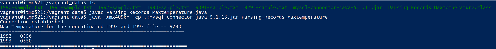

#Create a shell script that will:
#install a mysql database (or other appropriate tool)
#create a database and two tables to house each of the combined years #data (see the first weeks slides or text book for schema--must #include all data)

#step1: created a bootstrap.sh file which has sql installation as #well as table/ database craetion
#step2: gave a provisioning command in vagrantfile in order to run #the bootstrap.sh file while vagrant reload

#Write a script/program to parse the text and insert all records into #these tables (you have to handle any errors/bad data in your code)
#Write a program (Java or any other language) to process the data via #SQL to retrieve the highest temperature on record per year.

#step 3: placed the 1990, 1991, 1992, 1993 files in the data folder
#step 4: gave a synced folder commad in the vagrantfile so that the #files get reflected 
#step6: concatinated the file in /vagrant_data folder
#step 7: placed the Parsing_Records_Maxtemperature.java and sql #connector in data
#step 8:javac Parsing_Records_Maxtemperature.java
#step 9:  java -Xmx4096m -cp .:mysql-connector-java-5.1.13.jar #Parsing_Records_Maxtemperature

