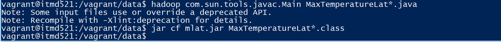

# Max temperature per 10 degree on latitude  

# Using Vim and the file name , we should create the following
## MaxTemperatureLat.java
## MaxTemperatureLatMapper.java
## MaxTemperatureLatReducer.java
## MaxTemperatureLatWithCombiner.java

# compile the file using the following command 
## hadoop com.sun.tools.javac.Main MaxTemperatureLat*.java
## jar cf mlat.jar MaxTemperatureLat*.class

# Further run the mapreduce job with the following command 
## hadoop jar mlat.jar MaxTemperatureLat 3initials/ncdc/9093/9093-sample.txt output/3initials/ncdc/9093/72

# view the output using the following command 
## hadoop fs -cat output/3initials/ncdc/9093/72/part-r-00000

# File Compilation Run  Max temperature per 10 degree on latitude  

# Running the Map reduce for max visibility Max temperature per 10 degree on latitude  

# Result Max temperature per 10 degree on latitude  

# 19888_jobhistory Max temperature per 10 degree on latitude  

# output considering 90 Max temperature per 10 degree on latitude  

# Explanation of how you devised a method to generate the answer:
## In MaxTemperatureLatMapper.java we check for "line.charAt(28) == '-'" 28th char to classify if its southern or northern Hemisphere
## As my last name is S I considered - for 28th char
## As the latitude is multiplied by 1000, divided the latitude by 1000 by considering 29 to 31st string
## Further grouping values for every 10 degrees to a key 
## therefore, there are 9 keys
## Max Temperature at latitude range 0-9.99, Max Temperature at latitude range 10-19.99 and so on(keys)
## passing this key value pair to the reducer
## The reducer filters out the maximum for every 10 degrees latitude with the help of the 9 keys
## hence the output is computed

