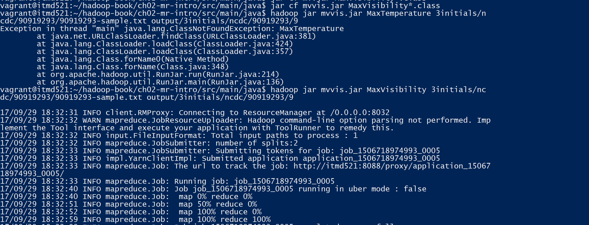
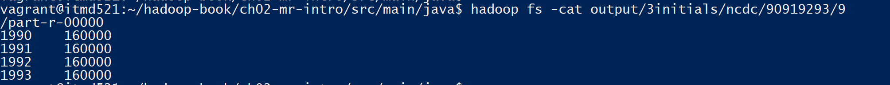
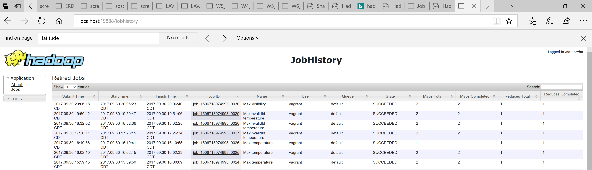

# 	Highest visibility per year  

# Using Vim and the file name , we should create the following files(I created in /vagrant_data)
## MaxVisibility.java
## MaxVisibilityMapper.java
## MaxVisibilityReducer.java
## MaxVisibilityWithCombiner.java

# compile the file using the following command 
## command: hadoop com.sun.tools.javac.Main MaxVisibility*.java
## command: jar cf mvvis.jar MaxVisibility*.class

# Further run the mapreduce job with the following command Highest visibility
## command: hadoop jar mvvis.jar MaxVisibility 3initials/ncdc/90919293/90919293-sample.txt output/3initials/ncdc/90919293/9 

# view the output using the following command  Highest visibility
## command: hadoop fs -cat output/3initials/ncdc/90919293/9/part-r-00000

# File Compilation Run -- Shows that the file has compiled successfuly Highest visibility

# Running the Map reduce job for max visibility

# Result Highest visibility

# Job History Highest visibility

