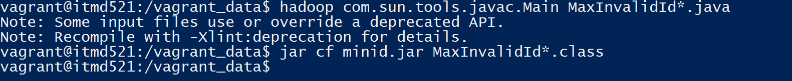
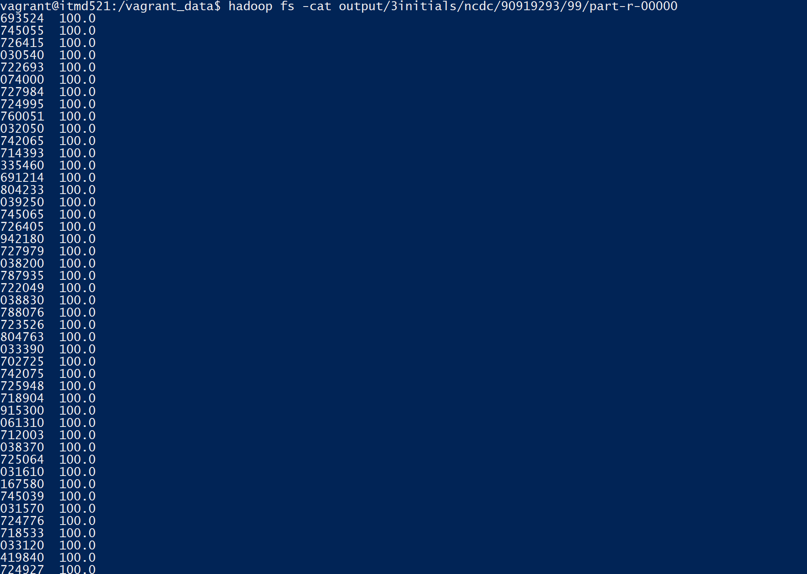
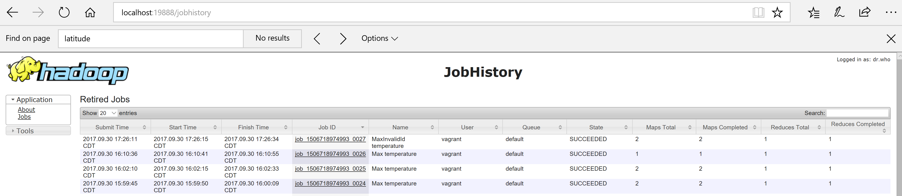

# Station ID that has most invalid temperature records (total in percentage)  

# Using Vim and the file name , we should create the following
## MaxInvalidId.java
## MaxInvalidIdMapper.java
## MaxInvalidIdReducer.java
## MaxInvalidIdWithCombiner.java

# compile the file using the following command for Station ID that has most invalid temperature records
## hadoop com.sun.tools.javac.Main MaxInvalidId*.java
## jar cf minid.jar MaxInvalidId*.class

# Further run the mapreduce job with the following command 
## hadoop jar minid.jar MaxInvalidId 3initials/ncdc/90919293/90919293-sample.txt output/3initials/ncdc/90919293/99

# view the output using the following command 
## hadoop fs -cat output/3initials/ncdc/90919293/99/part-r-00000

# File Compilation Run  Station ID that has most invalid temperature records

# Result Station ID that has most invalid temperature records

# job history Station ID that has most invalid temperature records

# Explanation
## passing all the values/records to a single key in the mapper, by concatenating record values/records (station id and temp)
## In the reducer, we are splitting the concatenated string station id and temperature values and storing in array list
## Further passing into hash map
## Further calculating the count of invalid data to valid data per station and calculating the % percentage
## hence gaining the output

