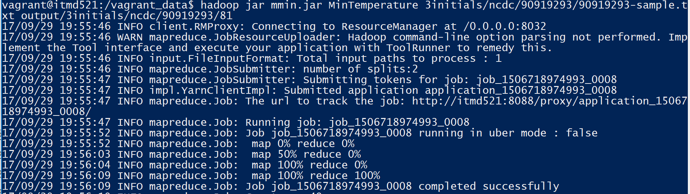
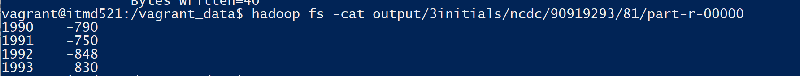
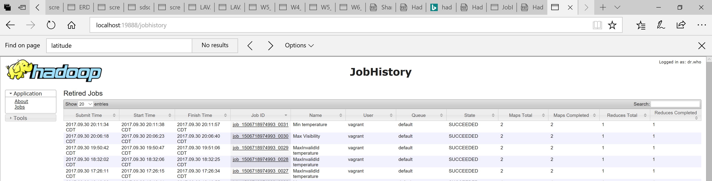

#	Minimum temperature per year   

# Using Vim and the file name , we should create the following
## MinTemperature.java
## MinTemperatureMapper.java
## MinTemperatureReducer.java
## MinTemperatureWithCombiner.java

# compile the file using the following command 
## hadoop com.sun.tools.javac.Main MinTemperature*.java
## jar cf mmin.jar MinTemperature*.class

# Further run the mapreduce job with the following command 
## hadoop jar mmin.jar MinTemperature 3initials/ncdc/90919293/90919293-sample.txt output/3initials/ncdc/90919293/81  

# view the output using the following command 
## hadoop fs -cat output/3initials/ncdc/90919293/81/part-r-00000

# File Compilation Run Minimum temperature

# Running the jar Minimum temperature

# Running the Map reduce for Minimum temperature

# Result Minimum temperature per year  

# job history Minimum temperature

